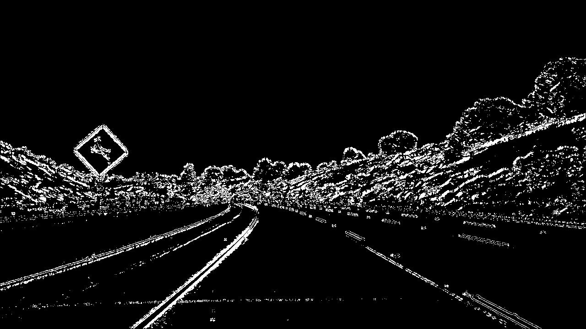
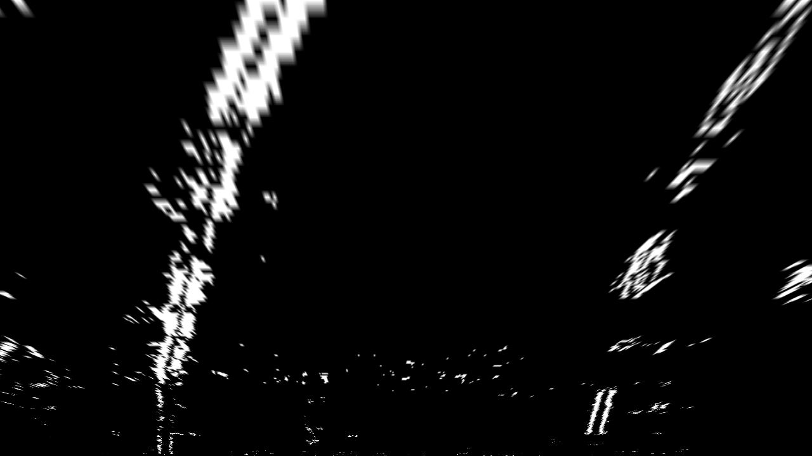

# Programmatic lane finding

## Overview ##
Given a video of a car driving in its lane, the program identifies the lane and draws it onto the image.

Steps: 

1. Calibrate the camera
1. Undistort images
1. Apply binary thresholds to identify lane lines
1. Transform perspective to birds-eye-view
1. Detect left/right lane pixels and determine curvature
1. Warp the detected lane back onto the original image

---
## Methodology ##

###1. Calibrate the camera

In calibrate.py, the camera is calibrated using opencv functions with 20 chessboard images from different angles and distances. calibrate_cam() looks for the 9x6 inner corners in each image and stores them in an array. An example chessboard image:

###2. Undistort images

Given these corners, the distortion matrix and distances are calculated using opencv and used to undistort images taken from this camera. undist() applies the undistortion.

An example image before undistortion: 

And after undistortion (notice how the edge of the top right bush changed):

###3. Apply binary thresholds to identify lane lines

threshold.py contains the fucntions for applying binary thresholds detect the lane lines.

1. abs_sobel_thresh(): calculates the threshold along either x (mostly vertical) or y (mostly horizontal) orients, given passed in thersholds (upper and lower bounds) and kernel values (which determines smoothness). The red color spectrum was found to give the best thresholds via guess and test.
1. mag_thresh(): creates a magnitude threshold baed on the combined values of the sobel in x and y directions.
1. dir_thresh(): sets a directional threshold for given bounds between 0 (horizontal) and pi/2 (vertical)
1. hls_thresh(): uses the saturation channel of the hls color spectrum as a binary threshold.
1. combo_thresh(): sets a pixel to 1 if it is found in either the x and y thresholds or if it is found in the magnitude, direction, and hls thresholds. 

The parameters were tuned by viewing each of the 5 thresholds independently and combined and looking for which combinations maximized lane pixels while also minimizing noise. 

After all thresholds are applied:

###4. Transform perspective to birds-eye-view

change_perspective(): takes a road image and maps it to the birds eye view. A transformation matrix, M, is calculated between the src points (4 corners of a straight lane) and the destination points (a rectangle/birds eye view of the lane). cv2.warpPerspective then maps the previous image to the birds eye view.

The src points are based proportionally on the size of the image, and were determined by picking 4 points on an image of the straight lane. 

After changing perspective, the left and right lines should appear parallel since they should curve the same amount at any point in the lane.

###5. Detect left/right lane pixels and determine curvature

*get_lr(): takes the warped and thresholded image and extracts the locations of the pixels in it. Given a range for the left and right lanes, the peak values across rows are found, corresponding to where there is likely a lane. 

A range around this value is then extracted as being likely to correspond to the lane. 

*get_points(): is a helper function to get the x and y coordinates of each pixel

*calc_curve(): takes the x and y coordinates of the pixels, fits a second order polynomial to them, and plots them. 

*(w/in calc curve): converts from pixel space to meter space and calculates the left and right curve radius.

##6. Warp detected lane back onto the original image

*draw_on_road(): Given the calculated lines of best fit, the x and y values are converted to points and filled in green. 

The inverse perspective transform of the original birds eye transform is used to warp the images back to the original image. 

*process_image(): Puts all the steps above together. An example end-product: 

## Acknowledgements 
Thank you to Udacity for selecting me for the nanodegree and helping me meet other self-driving car programmers.

## Todo
1. apply undistortion to images (10)
1. break out thresholding from other functions (10)
1. get a picture of the best fit lines for the lane pixels (0)
1. write the curvature and distance from center at top of each image (30)
1. average lane lines across time to reduce error (1)
1. discuss challenges faced -- finding right thresholding, getting the right lane to work correctly, passing img variable name between functions, (30)